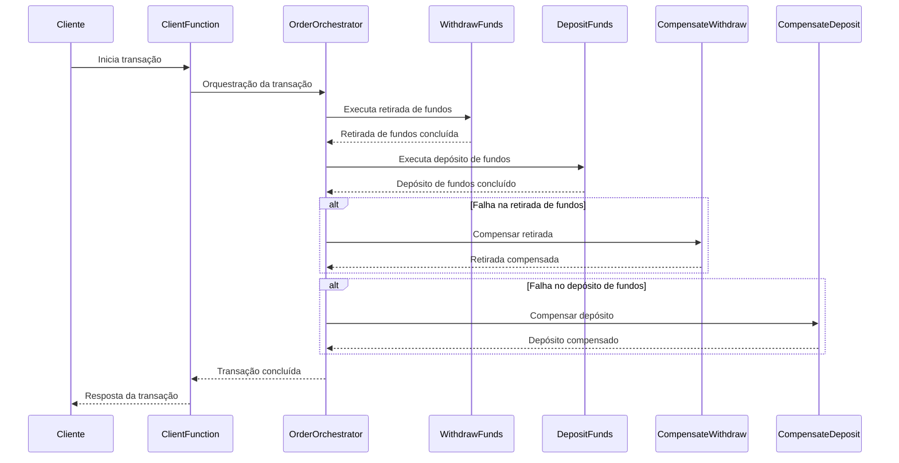

# Criando uma Arquitetura Coreografada baseada no Sagas Pattern com Azure Functions

## Introdução

Neste tutorial, vamos criar uma arquitetura coreografada utilizando o padrão Sagas para gerenciar transações distribuídas com Azure Functions. O exemplo será baseado em um sistema de transferência de fundos entre contas bancárias, onde implementaremos operações de depósito e saque, bem como suas respectivas compensações em caso de falha.

## Visão Geral da Arquitetura

A arquitetura será composta por várias funções Azure que desempenham papéis específicos:

- **ClientFunction**: Inicia a orquestração da transação.
- **OrderOrchestrator**: Coordena as etapas da transação.
- **DepositFunds**: Realiza o depósito de fundos.
- **WithdrawFunds**: Realiza o saque de fundos.
- **CompensateDeposit**: Reverte um depósito em caso de falha.
- **CompensateWithdraw**: Reverte um saque em caso de falha.

## Estrutura do Projeto

A estrutura do projeto é organizada da seguinte forma:

```
sagas_orchestration/
├── ClientFunction/
│   └── index.ts
├── CompensateDeposit/
│   └── index.ts
├── CompensateWithdraw/
│   └── index.ts
├── DepositFunds/
│   └── index.ts
├── OrderOrchestrator/
│   └── index.ts
├── WithdrawFunds/
│   └── index.ts
├── types/
│   └── index.d.ts
├── .funcignore
├── .gitignore
├── host.json
├── package.json
├── tsconfig.json
└── ... (outros arquivos de configuração)
```

## Implementação

### 1. Definindo os Tipos

Vamos começar definindo os tipos que serão usados nas transações. Crie o arquivo `types/index.d.ts`:

```typescript
interface Transaction {
    fromAccount: string;
    toAccount: string;
    amount: number;
}

interface WithdrawalResult {
    fromAccount: string;
    status: string;
    amount: number;
}

interface DepositResult {
    toAccount: string;
    status: string;
    amount: number;
}

interface TransactionData {
    withdrawalResult: WithdrawalResult | null,
    depositResult: DepositResult | null,
}
```

### 2. Iniciando a Orquestração

A `ClientFunction` inicia a orquestração das transações:

```typescript
import { AzureFunction, Context, HttpRequest } from "@azure/functions"
import * as df from "durable-functions"

const httpTrigger: AzureFunction = async function (context: Context, req: HttpRequest): Promise<void> {
    const client = df.getClient(context);
    const transaction = req.body; // Expects { fromAccount, toAccount, amount }

    const instanceId = await client.startNew("OrderOrchestrator", undefined, transaction);

    context.log(`Started orchestration with ID = '${instanceId}'.`);

    context.res = {
        status: 202,
        body: {
            message: "Transaction started.",
            instanceId: instanceId,
        },
    };
};

export default httpTrigger;
```

### 3. Orquestrando as Transações

A `OrderOrchestrator` coordena as etapas da transação:

```typescript
import * as df from "durable-functions"

const orchestrator = df.orchestrator(function* (context) {
    const transactionData = {
        withdrawalResult: null,
        depositResult: null,
    };

    const transaction = context.df.getInput();

    try {
        // Step 1: Withdraw funds
        transactionData.withdrawalResult = yield context.df.callActivity("WithdrawFunds", transaction);

        // Step 2: Deposit funds
        transactionData.depositResult = yield context.df.callActivity("DepositFunds", transaction);

        // Success: Return results
        return { success: true, data: transactionData };
    } catch (error) {
        // Compensate in reverse order of execution
        if (transactionData.depositResult) {
            yield context.df.callActivity("CompensateDeposit", transactionData.depositResult);
        }
        if (transactionData.withdrawalResult) {
            yield context.df.callActivity("CompensateWithdraw", transactionData.withdrawalResult);
        }

        // Return failure response
        return { success: false, error: error.message };
    }
});

export default orchestrator;
```

### 4. Implementando as Funções de Atividade

#### 4.1. Realizando o Saque

A função `WithdrawFunds` realiza o saque de fundos:

```typescript
import { AzureFunction, Context } from "@azure/functions"

const activityFunction: AzureFunction = async function (context: Context, transaction:Transaction): Promise<WithdrawalResult> {
    const { fromAccount, amount } = transaction;
    // Simulate withdrawing funds
    const result = { fromAccount, amount, status: "withdrawn" };
    context.log(`Funds withdrawn: ${amount} from account ${fromAccount}`);
    if (fromAccount === "Account1" && amount === 500) {
        throw new Error("Insufficient funds.");
    }
    return result;
};

export default activityFunction;
```

#### 4.2. Realizando o Depósito

A função `DepositFunds` realiza o depósito de fundos:

```typescript
import { AzureFunction, Context } from "@azure/functions"

const activityFunction: AzureFunction = async function (context: Context, transaction: Transaction): Promise<DepositResult> {
    const { toAccount, amount } = transaction;
    // Simulate depositing funds
    const result = { toAccount, amount, status: "deposited" };
    context.log(`Funds deposited: ${amount} to account ${toAccount}`);

    // Simulate failure for demonstration (uncomment to test failure)
    if (toAccount === "Account2" && amount === 500) {
        throw new Error("Deposit service unavailable.");
    }
    return result;
};

export default activityFunction;
```

### 5. Implementando as Funções de Compensação

#### 5.1. Compensando o Depósito

A função `CompensateDeposit` reverte um depósito em caso de falha:

```typescript
import { AzureFunction, Context } from "@azure/functions"

const activityFunction: AzureFunction = async function (context: Context, depositData: DepositResult): Promise<void> {
    context.log(`Compensating deposit for account ${depositData.toAccount}`);
    // Add logic to undo the deposit, for example, withdraw the funds from the account
    // Simulate compensating the deposit
};

export default activityFunction;
```

#### 5.2. Compensando o Saque

A função `CompensateWithdraw` reverte um saque em caso de falha:

```typescript
import { AzureFunction, Context } from "@azure/functions"

const activityFunction: AzureFunction = async function (context: Context, withdrawalData: WithdrawalResult): Promise<void> {
    context.log(`Compensating withdrawal for account ${withdrawalData.fromAccount}`);
    // Add logic to undo the withdrawal, for example, add the funds back to the account
    // Simulate compensating the withdrawal
};

export default activityFunction;
```

## Diagrama de Sequência



## Conclusão

Neste tutorial, implementamos uma arquitetura coreografada baseada no padrão Sagas para gerenciar transações distribuídas usando Azure Functions. Esta abordagem garante que, em caso de falhas durante as transações, as operações possam ser revertidas mantendo a consistência do sistema.

Você pode expandir este exemplo adicionando mais operações e compensações conforme necessário para atender aos requisitos do seu sistema.